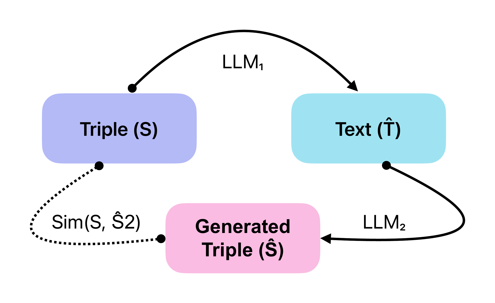
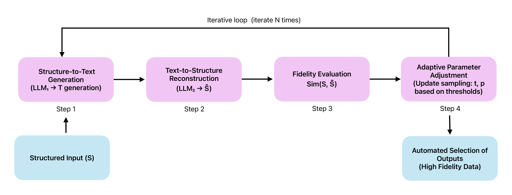

<p align="center">
  
</p>

<h1 align="center">From Graph to Text and Back</h1>
<h3 align="center">Semantic Fidelity in Automated Industrial Knowledge Graphs</h3>

<p align="center">
  <a href="https://2026.aclweb.org/"></a>
  <a href="LICENSE"></a>
  <a href="https://www.python.org/"></a>
  <a href="https://huggingface.co/"></a>
</p>

<p align="center">
  <b>Kamyar Zeinalipour</b> · Silvia Severini · Alessia Borghini · Sara Cardarelli · Marco Maggini · Marco Gori
  <br/>
  <em>University of Siena</em>
</p>

---

## 📄 Abstract

Knowledge Graphs (KGs) are the backbone of reliable industrial data strategies, yet verbalizing them with Large Language Models (LLMs) often leads to unacceptable risks — hallucinations and omitted relations — in high-stakes applications. We introduce a self-supervised **round-trip pipeline** that verbalizes KG triples into text and immediately reconstructs the original graph from that text; only verbalizations enabling perfect graph recovery are retained. This creates a closed feedback loop guaranteeing semantic equivalence between generated text and source data.

**Key findings:**
- Our automated round-trip similarity correlates strongly with expert human judgment (*r* > 0.5), serving as a scalable proxy for manual review
- Models can bootstrap their own KG-extraction accuracy by fine-tuning on self-generated high-fidelity data, with **LLaMA-3.2-3B achieving +1.72 points** on a 5-point human scale
- Quality drives improvement more than quantity — significant gains appear at just 25% of synthetic data

---

## 🏗️ Method

<p align="center">
  
</p>

The pipeline performs **N** iterative cycles:

1. **Structure → Text** — LLM₁ verbalizes KG triples into a candidate paragraph
2. **Text → Structure** — LLM₂ reconstructs triples from the generated text
3. **Fidelity Evaluation** — Round-trip similarity combines embedding cosine distance and lexical overlap:

$$\operatorname{sim}(S, \hat{S}, \alpha) = \alpha \cdot \cos(\phi(S), \phi(\hat{S})) + (1 - \alpha) \cdot \operatorname{sim}_{\text{lex}}(S, \hat{S})$$

4. **Adaptive Sampling** — Temperature and top-*p* are dynamically adjusted based on the fidelity score
5. **Selection** — Only outputs exceeding a strict threshold are retained

<p align="center">
  
</p>

---

## 📊 Results

### RQ1: Automated Metric Validity

Our round-trip similarity aligns closely with human expert ratings:

| Dimension | % Agreement | Fleiss's κ |
|:---------:|:-----------:|:----------:|
| CRA (Content & Relation Accuracy) | 89.8 | 0.63 |
| SGF (Structure, Grammar & Fluency) | 87.6 | 0.61 |
| OEC (Originality, Engagement & Creativity) | 88.2 | 0.68 |

### RQ2: Self-Supervised Fine-Tuning

| Model | Off-the-Shelf | Fine-Tuned | Δ |
|:------|:---:|:---:|:---:|
| LLaMA-2-7B | 2.70 | 3.32 | **+0.62** |
| LLaMA-3.2-3B | 2.30 | 4.02 | **+1.72** |
| LLaMA-3.2-1B | 1.94 | 2.70 | **+0.76** |

### Automatic Metrics (Base → Fine-Tuned)

| Model | BERTScore F1 | ROUGE-L F1 | BLEU-4 |
|:------|:---:|:---:|:---:|
| LLaMA-2-7B | 0.438 → 0.505 | 0.382 → 0.419 | 0.131 → **0.151** |
| LLaMA-3.2-3B | 0.372 → **0.514** | 0.409 → **0.442** | 0.089 → 0.147 |
| LLaMA-3.2-1B | 0.329 → 0.399 | 0.347 → 0.300 | 0.072 → 0.086 |

---

## 📁 Repository Structure

```
round-trip-kg/
├── generation/
│   └── round_trip_pipeline.py    # Round-trip generation loop (Algorithm 1)
├── training/
│   ├── train.py                  # SFTTrainer + LoRA fine-tuning
│   ├── utils.py                  # Model & dataset utilities
│   ├── configs/
│   │   └── deepspeed_config.yaml # DeepSpeed ZeRO-3 config
│   └── scripts/
│       └── run_training.sh       # Training launch script
├── inference/
│   ├── inference_finetuned.py    # Inference with LoRA-tuned models
│   ├── inference_base.py         # Inference with base models
│   └── parse_outputs.py          # Output parsing utilities
├── evaluation/
│   └── evaluate.py               # BERTScore, ROUGE, BLEU evaluation
├── figures/                      # Paper figures
├── requirements.txt
├── LICENSE
└── README.md
```

---

## 🚀 Quick Start

### 1. Installation

```bash
git clone https://github.com/Kamyar-zeinalipour/round-trip-kg.git
cd round-trip-kg
pip install -r requirements.txt
```

### 2. Run the Round-Trip Pipeline

```bash
python generation/round_trip_pipeline.py \
    --input_csv your_triples.csv \
    --text_model meta-llama/Llama-3.2-3B-Instruct \
    --triple_model meta-llama/Llama-3.2-3B-Instruct \
    --cycles 100 \
    --output_dir results/
```

The input CSV should have a `prompt` column containing KG triples in text format:

```
prompt
"Triple 1:\n  - Subject: Komodo Dragon\n  - Predicate: native_to\n  - Object: Indonesian islands\n..."
```

### 3. Fine-Tune on Self-Generated Data

```bash
cd training/scripts
chmod +x run_training.sh
./run_training.sh
```

Or launch a single model:

```bash
accelerate launch --config_file training/configs/deepspeed_config.yaml \
    training/train.py \
    --model_name_or_path meta-llama/Llama-3.2-3B-Instruct \
    --dataset_name Kamyar-zeinalipour/llama3b_kg \
    --use_peft_lora True \
    --lora_r 16 --lora_alpha 32 \
    --num_train_epochs 3 \
    --output_dir outputs/llama3b
```

### 4. Run Inference & Evaluate

```bash
# Inference (fine-tuned)
python inference/inference_finetuned.py

# Inference (base)
python inference/inference_base.py

# Parse outputs
python inference/parse_outputs.py --input_dir inference_results

# Evaluate
python evaluation/evaluate.py --input_dir inference_results/parsed
```

---

## 🤗 Models & Datasets

Training datasets are available on HuggingFace Hub:

| Dataset | Link |
|:--------|:-----|
| LLaMA-2-7B synthetic data | [`Kamyar-zeinalipour/llama2_kg`](https://huggingface.co/datasets/Kamyar-zeinalipour/llama2_kg) |
| LLaMA-3.2-1B synthetic data | [`Kamyar-zeinalipour/llama1b_kg`](https://huggingface.co/datasets/Kamyar-zeinalipour/llama1b_kg) |
| LLaMA-3.2-3B synthetic data | [`Kamyar-zeinalipour/llama3b_kg`](https://huggingface.co/datasets/Kamyar-zeinalipour/llama3b_kg) |

---

## ⚙️ Training Configuration

| Parameter | Value |
|:----------|:------|
| Framework | Transformers 4.41 + DeepSpeed 0.14 (ZeRO-2) |
| GPUs | 4 × NVIDIA RTX A6000 (48 GB) |
| Precision | bf16 |
| Learning rate | 1 × 10⁻⁴ (cosine decay) |
| Batch size | 4 per device (×2 grad accum = 16 effective) |
| Epochs | 3 |
| LoRA rank / α | 16 / 32 |
| LoRA dropout | 0.1 |
| Target modules | q, k, v, o, down, up, gate, embeddings, lm_head |
| Max sequence length | 512 tokens |
| Total training time | ~135 min (2,000 samples) |

---

## 📝 Citation

If you find this work useful, please cite:

```bibtex
@inproceedings{zeinalipour2026roundtrip,
    title     = {From Graph to Text and Back: Semantic Fidelity in Automated Industrial Knowledge Graphs},
    author    = {Zeinalipour, Kamyar and Severini, Silvia and Borghini, Alessia and Cardarelli, Sara and Maggini, Marco and Gori, Marco},
    booktitle = {Proceedings of the 64th Annual Meeting of the Association for Computational Linguistics: Industry Track},
    year      = {2026},
    publisher = {Association for Computational Linguistics}
}
```

---

## 📜 License

This project is licensed under the [MIT License](LICENSE).
